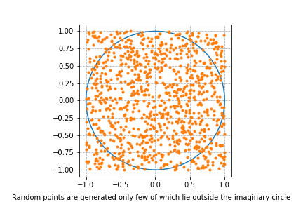

<h1 align="center">Exercises</h1>

## Exercise 1: Sum of the square roots using MPI

- Load modules `OpenMPI/4.0.3-GCC-9.3.0` and `Python/3.8.2-GCCcore-9.3.0`
- Run the code below on varying the number of cores (from 1 to 128 cores) and plot the CPU time (s) over the number of cores. 
- Create a shell script that generates automatically SLURM batch scripts.

```python
from mpi4py import MPI
import numpy as np

def sum_of_square_root(start, end):
    total = 0
    for i in range(start, end + 1):
        total += np.sqrt(i ** 2)
    return total

# Initialize MPI
comm = MPI.COMM_WORLD
rank = comm.Get_rank()
size = comm.Get_size()

# Define the range of values to sum for each process
N = 100000  # Replace with your desired value of N

local_start = 1 + rank * (N // size)
local_end = local_start + (N // size) - 1
if rank == size - 1:
    local_end += N % size  # Distribute the remainder


ts=MPI.Wtime()
# Calculate the sum of square root locally
local_result = sum_of_square_root(local_start, local_end)
te=MPI.Wtime()

max_cpu = comm.reduce(te-ts, op=MPI.MAX,root=0)
if rank == 0:
    print("cpu time is: ", max_cpu)

# Gather results from all processes
total_result = comm.reduce(local_result, op=MPI.SUM, root=0)

# Print the result from the root process
if rank == 0:
    print(f"The sum of squares from 1 to {N} is: {total_result}")
```

## Exercise 2: Computing Pi using Monte Carlo

- Monte Carlo methods are a broad class of computational algorithms that rely on repeated random sampling to obtain numerical results. 
- One of the basic examples of getting started with the Monte Carlo algorithm is the estimation of Pi.

## Estimation of Pi
- The idea is to simulate random (x, y) points in a 2-D plane with domain as a square of side 1 unit. 
- Imagine a circle inside the same domain with same diameter and inscribed into the square. 
- We then calculate the ratio of number points that lied inside the circle and total number of generated points. 
- Refer to the image below:



We know that area of the square is 1 unit sq while that of circle is $\pi \ast  (\frac{1}{2})^{2} = \frac{\pi}{4}$. Now for a very large number of generated points,


## The Algorithm

1. Initialize circle_points, square_points and interval to 0.
2. Generate random point x.
3. Generate random point y.
4. Calculate d = x*x + y*y.
5. If d <= 1, increment circle_points.
6. Increment square_points.
7. Increment interval.
8. If increment < NO_OF_ITERATIONS, repeat from 2.
9. Calculate pi = 4*(circle_points/square_points).
10. Terminate.


- Load modules `OpenMPI/4.0.3-GCC-9.3.0` and `Python/3.8.2-GCCcore-9.3.0`
- Write a unique SLURM batch file to run the code below, with different `total_points` (e.g. 1000,10000,100000,1000000) and with different number of cores (e.g. 1, 2, 4, 8).

```python
from mpi4py import MPI
import random

random.seed(42)

# Initialize MPI                                                                                                                                                                                            
comm = MPI.COMM_WORLD
rank = comm.Get_rank()
size = comm.Get_size()


# Total number of points to generate                                                                                                                                                                        
import sys
total_points = int(sys.argv[1])

# Number of points in the circle                                                                                                                                                                            
points_in_circle = 0

# Generate random points and perform local calculation                                                                                                                                                      
local_points = total_points // size


ts=MPI.Wtime()
for _ in range(local_points):
    x = random.uniform(0, 1)
    y = random.uniform(0, 1)
    if x**2 + y**2 <= 1:
        points_in_circle += 1
te=MPI.Wtime()

max_cpu = comm.reduce(te-ts, op=MPI.MAX,root=0)

if rank == 0:
    print("With", total_points, "samples, the cpu time using", size, "core(s) is: ", max_cpu)


# Reduce the number of points in the circle from all processes                                                                                                                                              
total_points_in_circle = comm.reduce(points_in_circle, op=MPI.SUM, root=0)

if rank == 0:
    # Calcule Pi en utilisant le résultat global                                                                                                                                                            
    pi_approximation = 4.0 * total_points_in_circle / total_points
    print(f"Approximation de Pi: {pi_approximation}")
```

## Exercise 3:  
